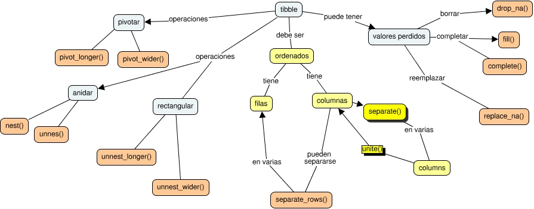

# Examen de Teaching - Rstudio Certification

## Ordenando datos con tidyr 

* [Slides](https://data-datum.github.io/tidyr/clase.html#1) 

### Learner Persona (Descripción de estudiantes tipo)
#### Alumnx 1: 
Luisa es licenciada en biología y actualmente se encuentra haciendo el doctorado en Biología. Se dedica al estudio de genómica en plantas. Es profesora de la materia “Introducción a la Biología” en la materia de 1er año de la facultad. Necesita aprender R para analizar sus datos y automatizar algunos procesos de los datos que obtiene experimentalmente para su tesis de doctorado. Sabe usar Excel desde la carrera de grado y aprendió algo de R base en estadística, pero de manera superficial. Quisiera aprender a hacer gráficos con ggplot2 para poder hacer visualizaciones aptas para publicar además de ordenar y limpiar sus datos.

#### Alumnx 2:
Eugenia es ingeniera agrónoma y está haciendo su maestría en producción vegetal. Realiza trabajos mayormente en el campo y no es muy amiga de las computadoras. Es profesora en la materia “Citricultura” de la carrera de Ingeniería agronómica.
Sabe usar infostat que es una IDE para análisis estadístico simple y Excel, además de Word y Powerpoint. Le interesa R para hacer cálculos de modelos mixtos para sus experimentos. No tiene nada de experiencia en programación. También le interesa aprender a hacer gráficos para poder publicar los trabajos de su maestría. 

### Mapa Conceptual del tema (Concept Map)




### Evaluación formativa (Formative assessment)

### Librerias necesarias 

``` r
#Si no tengo instalada la libreria tidyverse
#install.packages("tidyverse")

#cargo librerias
library(tidyverse)

```


#### Pregunta 1
``` r
table3 %>%
    separate(__________, 
             c("cases", "population"), 
             sep="__")
```

#### Solución 1

``` r
table3 %>%
    separate(rate, #columna para dividir los datos
             c("cases", "population"), #nuevas columnas
             sep="/") #separador
```

#### Pregunta 2 

```r
table1 %>%
  unite("rate",
        _____, _________,
        sep="__")
```


#### Solución 2

```r
table1 %>%
  unite("rate",
        cases, population,
        sep="/")
```


