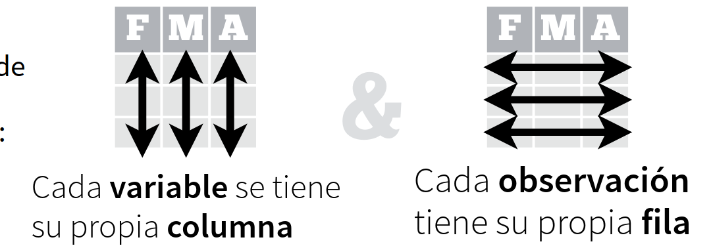

---
output:
  xaringan::moon_reader:
    lib_dir: libs
    css: xaringan-themer.css
    nature:
      highlightStyle: github
      highlightLines: true
      countIncrementalSlides: false
---


```{r xaringan-extra-styles, include=FALSE}
xaringanExtra::use_extra_styles(
  hover_code_line = TRUE,         #<<
  mute_unhighlighted_code = TRUE  #<<
)
```


```{r , echo=FALSE}
xaringanExtra::use_tachyons()
xaringanExtra::use_panelset()
```


```{r include=FALSE}
library(countdown)
```

```{r setup, include=FALSE}
options(htmltools.dir.version = FALSE)
```

```{r xaringan-themer, include=FALSE, warning=FALSE}
library(xaringanthemer)
style_duo_accent(
  primary_color = "#382c6d",
  secondary_color = "#382c6d",
  inverse_header_color = "#FFFFFF"
)
#style_duo_accent(
  #header_font_google = google_font("Microsoft Sans Serif", "500"),
  #text_font_google   = google_font("Microsoft Sans Serif", "400", "300i"),
  #code_font_google   = google_font("Microsoft Sans Serif")
#)
```

```{r , message=FALSE, warning=FALSE, include=FALSE} 
library(fontawesome)
library(emo)
```


```{r xaringan-tachyons, echo=FALSE}
xaringanExtra::use_tachyons()
xaringanExtra::use_fit_screen()
```


# Ordenando datos con tidyr 


---

# Que vamos a ver en este módulo


---

# Datos ordenados

Se entiende por datos ordenados


```{r echo=FALSE, out.width = '75%',  fig.align='center'}

```


---


# Ingresamos los datos

```{r  message=FALSE}
library(tidyverse)
tormentas <- read_csv("tormentas.csv")
tormentas
```


---

# `separate()`

Nos permite separa una columna en otras columnas 

```{r}
torm1 <- tormentas %>% #set de datos 
  separate(fecha, #columna a dividir
           c("anio", "mes", "dia"), #divido en estas 3 columnas
           sep="-") #estan separadas por guion
torm1
```


.footnote[https://tidyr.tidyverse.org/reference/separate.html]

---

# `unite()`

Nos permite unir columnas en una sola


```{r, message=FALSE}
torm2 <- torm1 %>%
  unite("fecha", #se crea la columna date
        anio, mes, dia, #a partir de estas tres
        sep="-") #separadas por un guion
torm2
```


  

---

# Ejercicios `r emo::ji("rocket")`


```{r}

```


---

# Solución 


