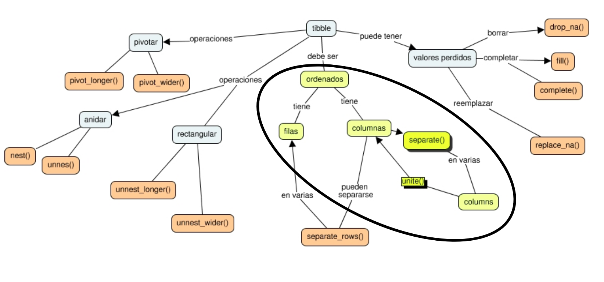

---
output:
  xaringan::moon_reader:
    lib_dir: libs
    css: xaringan-themer.css
    nature:
      highlightStyle: github
      highlightLines: true
      countIncrementalSlides: false
---
background-image: url(img/portada.png)
background-size: cover
class: animated slideInRight fadeOutLeft, middle


```{r xaringan-extra-styles, include=FALSE}
xaringanExtra::use_extra_styles(
  hover_code_line = TRUE,         #<<
  mute_unhighlighted_code = TRUE  #<<
)
```

```{r xaringan-logo, echo=FALSE}
xaringanExtra::use_logo("img/tidyr.png")
```


```{r , echo=FALSE}
xaringanExtra::use_tachyons()
xaringanExtra::use_panelset()
```


```{r include=FALSE}
library(countdown)
```

```{r setup, include=FALSE}
options(htmltools.dir.version = FALSE)
```

```{r xaringan-themer, include=FALSE, warning=FALSE}
library(xaringanthemer)
style_duo_accent(
  primary_color = "#531c75",
  secondary_color = "#382c6d",
  inverse_header_color = "#FFFFFF"
)
style_duo_accent(
  header_font_google = google_font("Libre Caslon Text", "500"),
  text_font_google   = google_font("Libre Caslon Text", "400", "300i"),
  code_font_google   = google_font("Source Code Pro")
)
```

```{r , message=FALSE, warning=FALSE, include=FALSE} 
library(fontawesome)
library(emo)
```


```{r xaringan-tachyons, echo=FALSE}
xaringanExtra::use_tachyons()
xaringanExtra::use_fit_screen()
```


# Ordenando datos con tidyr
### Roxana Noelia Villafañe


---


# tidyr

--

# es una libreria de tidyverse 

--

# para ordenar datos


---

# tidyr 

Las funciones de tidyr pueden caer en estas 5 categorías:

--

`r emo::ji("pushpin")` Separar y unir columnas de caracteres con `separate()` y `unite()`.


--

`r emo::ji("pushpin")`  [Pivotar tablas](https://tidyr.tidyverse.org/articles/pivot.html): con funciones como `pivot_longer()` y `pivot_wider()`.

--

`r emo::ji("pushpin")` [Rectangular datos](https://tidyr.tidyverse.org/articles/rectangle.html). 

--

`r emo::ji("pushpin")` [Anidar datos](https://tidyr.tidyverse.org/articles/nest.html) y desanidarlos. 

--

`r emo::ji("pushpin")` Trabajar con valores perdidos. 

--

.footnote[Fuente: Documentación de tidyr - https://tidyr.tidyverse.org/]

---

# Mapa Conceptual del tema

<br><br>


```{r echo=FALSE, out.width = '130%',  fig.align='center'}
knitr::include_graphics("img/map.jpg")
```


---


# En esta clase

<br>


```{r echo=FALSE, out.width = '130%',  fig.align='center'}

```


---

# Datos ordenados

Se entiende por **datos ordenados**

--

`r emo::ji("pushpin")` **.black[Cada variable en su columna]**

--

`r emo::ji("pushpin")` **.black[Cada observación en su propia fila]**

--

`r emo::ji("pushpin")` **.black[Cada valor en una celda]**

--

```{r echo=FALSE, out.width = '100%',  fig.align='center'}
knitr::include_graphics("img/tidy-1.png")
```


---

# Ingresamos los datos

```{r  message=FALSE}
library(tidyverse)
tormentas <- read_csv("tormentas.csv")
tormentas
```


---

# `separate()`

--

**Nos permite separa una columna en otras columnas**

--

```{r}
torm1 <- tormentas %>% #set de datos 
  separate(fecha, #columna a dividir
           c("anio", "mes", "dia"), #divido en estas 3 columnas
           sep="-") #estan separadas por guion
torm1
```


.footnote[Mas información: https://tidyr.tidyverse.org/reference/separate.html]

---

# Ejercicio `r emo::ji("pencil")`


```{r}
tidyr::table3
```


```{r eval=FALSE}
table3 %>%
    separate(__________, 
             c("cases", "population"), 
             sep="__")
```


---

# Solución 

```{r}
table3 %>%
    separate(rate, #columna para dividir los datos
             c("cases", "population"), #nuevas columnas
             sep="/") #separador
```


---

# `unite()`

--

**Nos permite unir columnas en una sola**

--

```{r, message=FALSE}
torm2 <- torm1 %>%
  unite("fecha", #se crea la columna date
        anio, mes, dia, #a partir de estas tres
        sep="-") #separadas por un guion
torm2
```


  
.footnote[Mas información: https://tidyr.tidyverse.org/reference/unite.html]

---

# Ejercicio `r emo::ji("pencil")`

```{r}
tidyr::table1
```

```{r eval=FALSE}
table1 %>%
  unite("rate",
        _____, _________,
        sep="__")
```


---

# Solución


```{r}
table1 %>%
  unite("rate",
        cases, population,
        sep="/")
```


---
background-image: url(img/portada.png)
background-size: cover
class: animated slideInRight fadeOutLeft, middle


# Muchas gracias! 